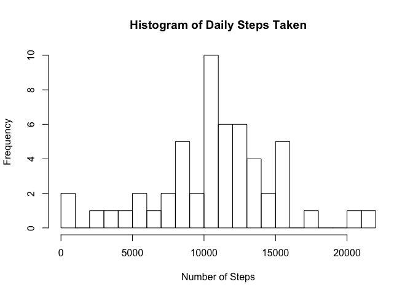
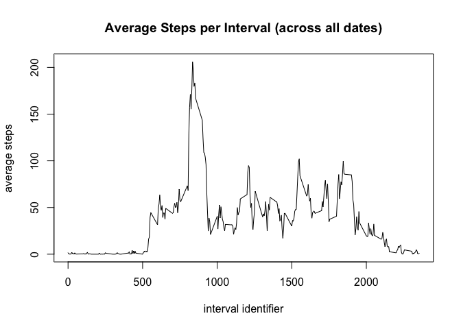
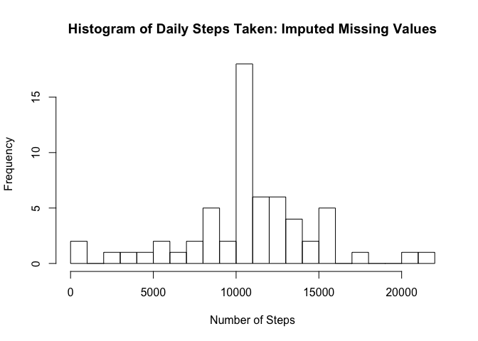
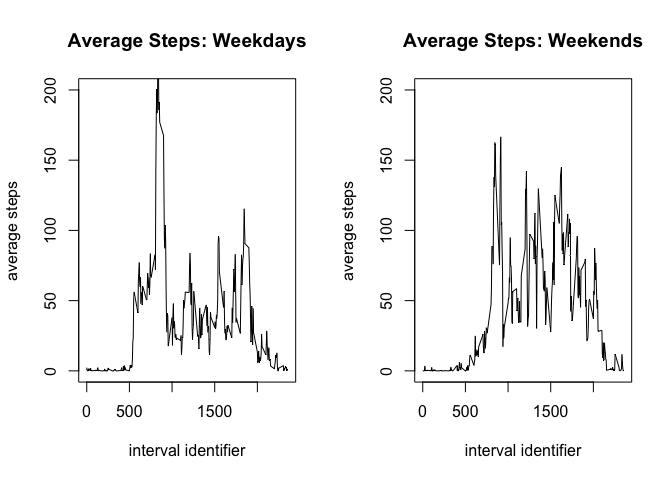

# Reproducible Research: Peer Assessment 1: JOANNA SAIKALI


## Loading and preprocessing the data
First we will load the dataset:

```r
if(!require("data.table")) install.packages("data.table")
```

```
## Loading required package: data.table
```

```r
library(data.table)
dataset<-fread("activity.csv")
```


## What is mean total number of steps taken per day?
Below is a histogram of the total number of steps taken each day:

```r
agTot<-aggregate(steps~date, data=dataset, FUN=sum, na.rm=TRUE)
hist(agTot$steps, breaks=20, xlab="Number of Steps", main="Histogram of Daily Steps Taken")
```

<!-- -->

Now I calculate the mean and median total daily steps:

```r
stepsMean<-round(mean(agTot$steps, na.rm = TRUE),2)
stepsMedian<-round(median(agTot$steps, na.rm=TRUE),2)
```
The mean number of total daily steps is 10766.19 and the median is 10765   

## What is the average daily activity pattern?
Below is a time series plot of average steps per time interval, across all dates:

```r
agAvg<-aggregate(steps~interval, data=dataset, FUN=mean, na.rm=TRUE)
plot(type="l", x=agAvg$interval, y=agAvg$steps, xlab = "interval identifier", ylab="average steps", main="Average Steps per Interval (across all dates)")
```

<!-- -->

Now I will determine which interval has the maximum number of steps on average:

```r
maxAvgRow<-agAvg[which.max(agAvg$steps),]
maxAvgValue<-maxAvgRow$steps
maxAvgInterval<-maxAvgRow$interval
```
The 5-minute interval #835 contains the maximum number of steps (206.17 steps) on average across all the days in the dataset

## Imputing missing values

For the missing data in this dataset (i.e. the intervals with "NA" in the "steps" column), I will replace NA values with the average value for that interval across all dates, rounded to the nearest integer.  
  
First we will determine the number of observations with NA values for steps:

```r
NAindeces<-which(is.na(dataset$steps))
numNA<-length(NAindeces)
```
There are a total of 2304 missing values in the dataset.

Some NA rows BEFORE imputing missing data:

```r
head(dataset[NAindeces])
```

```
##    steps       date interval
## 1:    NA 2012-10-01        0
## 2:    NA 2012-10-01        5
## 3:    NA 2012-10-01       10
## 4:    NA 2012-10-01       15
## 5:    NA 2012-10-01       20
## 6:    NA 2012-10-01       25
```

Now we will actually impute the missing values & replace them with the rounded average for that interval across all days. The new dataset (equal to the original dataset but with the missing data filled in) is called imputedData.  

```r
imputedData<-dataset
for(i in NAindeces)  imputedData[i,'steps']<-round(agAvg[match(imputedData[i, 'interval'],agAvg$interval),'steps'],0)
```

Some NA rows AFTER imputing missing data:

```r
head(imputedData[NAindeces])
```

```
##    steps       date interval
## 1:     2 2012-10-01        0
## 2:     0 2012-10-01        5
## 3:     0 2012-10-01       10
## 4:     0 2012-10-01       15
## 5:     0 2012-10-01       20
## 6:     2 2012-10-01       25
```

Below is a histogram of the total number of steps taken each day, WITH the imputed values:

```r
agTotImp<-aggregate(steps~date, data=imputedData, FUN=sum, na.rm=TRUE)
hist(agTotImp$steps, breaks=20, xlab="Number of Steps", main="Histogram of Daily Steps Taken: Imputed Missing Values")
```

<!-- -->

Now I calculate the mean and median total daily steps after imputing missing values:

```r
stepsMeanImp<-round(mean(agTotImp$steps),2)
stepsMedianImp<-round(median(agTotImp$steps),2)
```
With imputed missing values, the mean number of total daily steps is 10765.64 and the median is 10762  

##### Do these values differ from the estimates from the first part of the assignment? What is the impact of imputing missing data on the estimates of the total daily number of steps?)
Prior to imputing, the mean was 10766.19 and the median was 10765. The difference is not drastic, but the histogram, mean, and median seem to reflect a lower number of steps. The histogram smoothed out a bit to a more bell-curve-type shape. Overall, imputing missing values makes the data smoother and may give a more complete and whole picture, especially if there is a bias for intervals with missing values (for example, if intervals 0-20 are more likely to have missing values). In this case, each interval has exactly 8 missing values (as demonstrated below), so such a bias does not exist, but it is an important factor to take into account.

```r
head(table(dataset[NAindeces,'interval']))
```

```
## 
##  0  5 10 15 20 25 
##  8  8  8  8  8  8
```

## Are there differences in activity patterns between weekdays and weekends?

Below is a time series plot demonstrating the difference between average steps on weekdays versus weekends. The activity gives us insight into participants' schedules. It looks like there is a sudden leap in activity on weekdays at interval 500, which is around 8:00am, for which we can speculate that people are going to work. At a similar time on weekends, however, the increase in activity is more gradual and tends to be later, indicating that people may be sleeping in or taking their time in the mornings. There are many interesting such trends to inspect with this data. Overall this time series gives us valuable insights in daily activity for individuals on weekdays and weekends.


```r
imputedData$day<-weekdays(as.Date(imputedData$date))
weekend_dates<-c('Saturday', 'Sunday')
imputedData$wDay<-factor((imputedData$day %in% weekend_dates), levels=c(FALSE,TRUE), labels=c('Weekday', 'Weekend'))
agAvgWday<-aggregate(steps~interval+wDay, data=imputedData, FUN=mean, na.rm=TRUE)
par(mfrow=c(1, 2))
plot(type="l", x=subset(agAvgWday, wDay=='Weekday')$interval, y=subset(agAvgWday, wDay=='Weekday')$steps, xlab = "interval identifier", ylab="average steps", main="Average Steps: Weekdays", ylim=c(0,200))
plot(type="l", x=subset(agAvgWday, wDay=='Weekend')$interval, y=subset(agAvgWday, wDay=='Weekend')$steps, xlab = "interval identifier", ylab="average steps", main="Average Steps: Weekends", ylim=c(0,200))
```

<!-- -->

